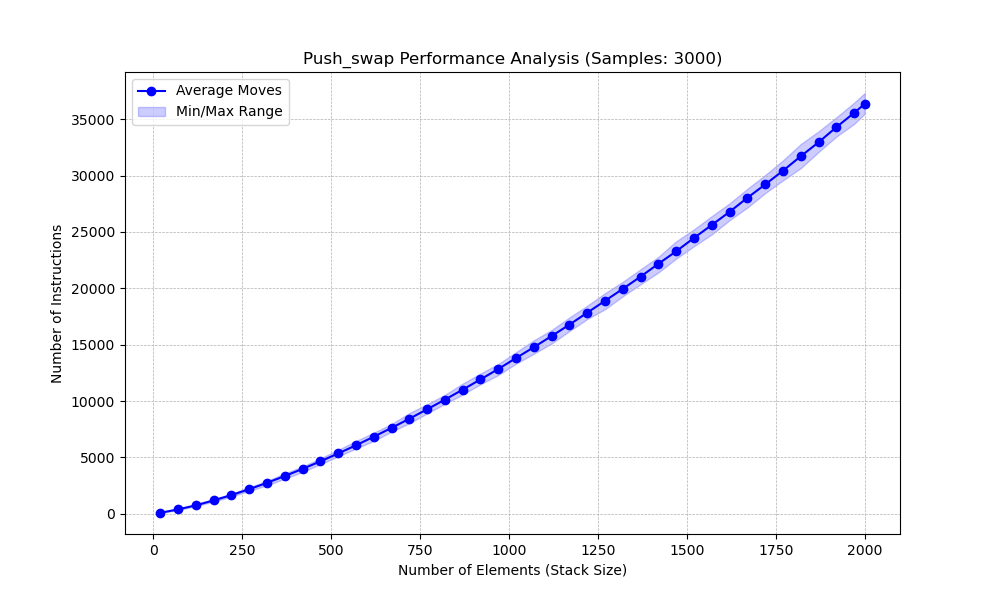

# Pushswap

This project has been created as part of the 42 curriculum by yaqliu.

## Description

The Push_swap project is a simple yet highly structured algorithmic challenge: you need to sort data. In this project, you will sort data in a stack using a limited set of instructions, aiming to achieve the lowest possible number of actions.
You have at your disposal a set of integer values, 2 stacks, and a set of instructions to manipulate both stacks. Your goal is to write a C program called `push_swap` that calculates and displays the shortest sequence of Push_swap instructions needed to sort the given integers.
At the beginning:
* Stack `a` contains a random number of unique negative and/or positive integers.
* Stack `b` is empty.
* The goal is to sort the numbers in stack `a` in ascending order.

## Instructions

### Compilation
To compile the project, run `make` at the root of the repository. The Makefile will compile the source files to the required output with the flags `-Wall`, `-Wextra`, and `-Werror`, using `cc`.
```bash
make
```

### Execution
The program named `push_swap` takes as an argument the stack `a` formatted as a list of integers. The first argument should be at the top of the stack.

```bash
make
./push_swap 42 1337 24 1 5
```

The program must display the shortest sequence of instructions needed to sort stack `a` with the smallest number at the top. Instructions must be separated by a `\n` and nothing else. If no parameters are specified, the program must not display anything and should return to the prompt.

## Resources
* **AI Usage:**
* 

## Performance Analysis

