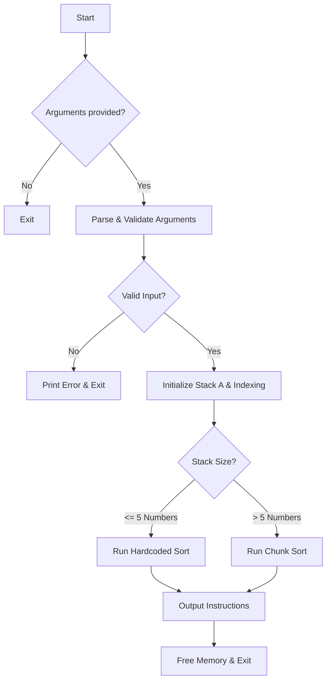

# Pushswap

This project has been created as part of the 42 curriculum by yaqliu.

---

## Description

The Push_swap project is a simple yet highly structured algorithmic challenge: you need to sort data. In this project, you will sort data in a stack using a limited set of instructions, aiming to achieve the lowest possible number of actions.
You have at your disposal a set of integer values, 2 stacks, and a set of instructions to manipulate both stacks. Your goal is to write a C program called `push_swap` that calculates and displays the shortest sequence of Push_swap instructions needed to sort the given integers.
At the beginning:
* Stack `a` contains a random number of unique negative and/or positive integers.
* Stack `b` is empty.
* The goal is to sort the numbers in stack `a` in ascending order.

### Algorithm

The program implements a hybrid approach to sorting, optimizing for both small and large datasets.

### Workflow
Here is a high-level overview of the program's execution flow:



### Approach
1.  **Input Parsing**: Arguments are validated to ensure they are unique integers. Rank indexing is pre-calculated to handle values efficiently.
2.  **Small Cases**: For lists with 5 or fewer numbers, the program uses hardcoded logic (`small_cases.c`) to sort with the absolute minimum number of moves.
3.  **Large Cases (Chunk Sort)**:
    *   **Phase 1 (A to B)**: The stack A is divided into chunks based on rank size (calculated via square root approximation). Elements are pushed to stack B in chunks.
    *   **Phase 2 (Sorting in B)**: Logic applies to keep larger elements of the chunk near the top of B or rotate them to the bottom to prepare for the return trip.
    *   **Phase 3 (B to A)**: Elements are pushed back to A in strict descending order (finding max in B), resulting in a sorted stack A.

### Performance Analysis


These graphs illustrate the efficiency of the sorting algorithm in terms of operation count across different stack sizes. They demonstrate how the algorithm scales and stays well within the project's required limits. The visualizations were generated using the testing scripts from the repository linked in the **Resources** section below.

---

## Instructions

### Compilation
To compile the project, run `make` at the root of the repository. The Makefile will compile the source files to the required output with the flags `-Wall`, `-Wextra`, and `-Werror`, using `cc`.
```bash
make
```

### Execution
The program named `push_swap` takes as an argument the stack `a` formatted as a list of integers. The first argument should be at the top of the stack.

```bash
make
./push_swap 42 1337 24 1 5
```
The program must display the shortest sequence of instructions needed to sort stack `a` with the smallest number at the top. Instructions must be separated by a `\n` and nothing else. If no parameters are specified, the program must not display anything and should return to the prompt.

---

### Bonus: The Checker

The project includes a bonus part: a custom `checker` program that validates if a set of instructions actually sorts the stack.

#### Compilation
To compile the bonus part, use:
```bash
make bonus
```
This generates an executable named `checker`.

#### Usage
The checker waits for instructions on the standard input (stdin). After receiving instructions, it outputs `OK` if the stack is sorted, or `KO` if not.

**Testing Commands Explanation:**

Here are three ways to test the program using the checker (assuming `checker_linux` is the provided binary, or replace with `./checker` for your own):

1.  **Direct Pipe**:
    ```bash
    ARG=$(python3 -c "import random; print(' '.join(map(str, random.sample(range(1000), 10))))"); echo "Args: $ARG"; ./push_swap $ARG | ./checker_linux $ARG
    ```
    *   Generates a random list of numbers.
    *   Runs `push_swap` to generate instructions.
    *   Pipes (`|`) those instructions directly to the checker.
    *   **Best for:** Quick verification.

2.  **File Redirection**:
    ```bash
    ARG=$(python3 -c "import random; print(' '.join(map(str, random.sample(range(1000), 10))))"); ./push_swap $ARG > out; ./checker_linux $ARG < out; wc -l < out
    ```
    *   Saves instructions to a file named `out` (`> out`).
    *   Feeds `checker` with content of `out` (`< out`).
    *   Counts lines in `out` (`wc -l`) to see the number of moves.
    *   **Best for:** Debugging and checking operation count explicitly.

3.  **Variable Capture**:
    ```bash
    ARG=$(python3 -c "import random; print(' '.join(map(str, random.sample(range(1000), 10))))"); out=$(./push_swap $ARG); echo "$out" | ./checker_linux $ARG; echo "$out" | wc -l
    ```
    *   Stores instructions in a shell variable `$out`.
    *   Echoes the variable to the checker.
    *   Echoes the variable to `wc -l`.
    *   **Best for:** Scripts where file creation is avoided.

---

## Resources
* **AI Usage:** Used for automation tasks, such as the shell commands used in the bonus testing, and to attempt optimizations in the sorting strategy.
* [Repo with scripts to analyse algorithm's performance](https://github.com/lyqsbf/pushswap_performance_analysis)
